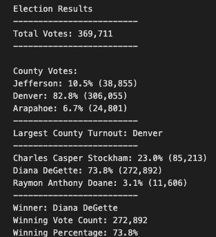

# Election_Analysis
## Project Overview 

- Calculate the total number of votes
- Get a complete list of candidates who received votes
- Calculate the total number of votes for each candidate
- Calculate the percentage won by each candidate

## Resources
- Data Source: election_results.csv
- Software : Python 3.7.6
- Visual Studio Code 1.47.3

### The Analysis of the election:
      
   

- There were 369,711 votes cast in the election.

### The candidates were :

- Charles Casper Stockman
- Diana DeGette
- Raymon Anthony Doane

### The canidates results were:

- Charles Casper Stockham received 85,213 votes and 23.0% of votes cast.

- Diana DeGette received 272,892 votes and 73.8% of votes cast.

- Raymon Anthony Doane received 11,606 votes and  3.1% of votes cast.

### The winner of the election was :

- Diana DeGette who had the majority at 73.8% totaling out to 272,892 votes. 

## Challenge Summary 

For the Challenge, I did an analysis based on county instead of candidate.

### Breakdown by county

- Jefferson County had 38,855 votes and 10.5% of votes cast.
- Denver County had 306,055 votes and 82.8% of votes cast.
- Arapahoe County had  24,801 and 6.7% of votes cast.

#### County with the largest turnout:

- Denver had the most votes in this election

## Summary statement 

Although this script could be used ofr any election, some modifications would have to be made. The csv file would need to be switched to the next one chosen and then we switch the file paths, double check we are calling the right indexs(since files differ) and we would be good to go! If we canted to go by state vs by county for a bigger election we could even updated the dictionaries and variables to do so. 

Another  analysis that could be done is counting each candidates vote by county but that would come with more modifications. 

